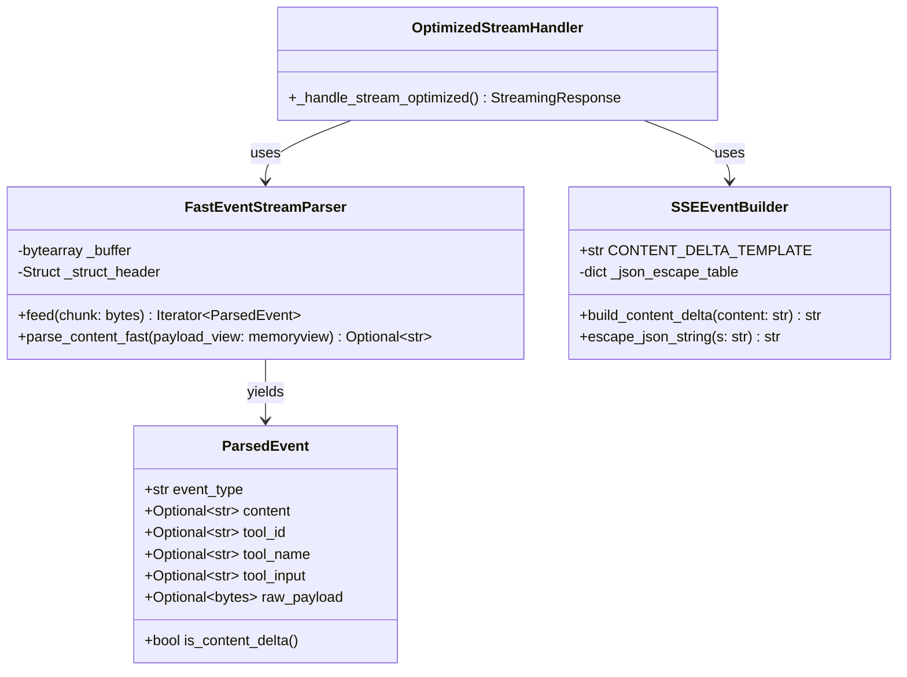

# 设计文档：流式性能优化

## 概述

本设计旨在优化 Kiro 代理服务的流式响应性能，降低从 Kiro API 接收数据到用户看到 token 之间的延迟。当前实现在 `kiro_proxy/handlers/anthropic.py` 的 `_handle_stream` 函数中，每个 chunk 都需要完整解析 AWS event-stream 二进制格式、JSON 解码 payload、构造 SSE JSON 字符串并序列化，这些操作累积成显著的单 token 输出延迟。

### 性能瓶颈分析

当前实现的主要性能问题：

1. **重复的字节切片操作**：每次解析都创建新的字节对象副本
2. **低效的整数解析**：使用 `int.from_bytes` 而非 `struct.unpack`
3. **完整 JSON 解析**：即使只需要 `content` 字段也解析整个 payload
4. **重复的 JSON 序列化**：每个 SSE 事件都完整序列化 JSON 对象
5. **数据累积**：在内存中保存 `full_response` 和 `full_content`
6. **延迟输出**：等待 chunk 完全处理后才 yield

### 优化目标

- 降低单 token 延迟至少 30%
- 减少内存分配和拷贝操作
- 保持与现有 Anthropic API 的完全兼容
- 确保所有 event-stream 消息类型正确处理

## 架构

### 当前架构

```
HTTP Stream → chunk → 完整解析 → JSON decode → 构造对象 → JSON encode → SSE yield
                ↓
           累积 full_response
```

### 优化后架构

```
HTTP Stream → chunk → 快速解析 → 增量提取 → 模板化输出 → 立即 yield
                              ↓
                         零拷贝传递
```

### 架构决策

1. **分离快速路径和慢速路径**
   - 快速路径：content delta 事件，使用优化的解析和模板化输出
   - 慢速路径：tool_use、message_start 等，使用完整解析

2. **增量处理**
   - 不等待完整 chunk，边接收边解析
   - 解析出 content 立即 yield，不等待 chunk 结束

3. **零拷贝设计**
   - 使用 memoryview 避免字节切片
   - 直接在原始缓冲区上操作

4. **模板化输出**
   - 预构建 SSE 事件模板
   - 只对变化的 content 进行 JSON 转义

## 组件和接口

### 1. FastEventStreamParser

优化的 event-stream 解析器，专注于快速提取 content 字段。

```python
class FastEventStreamParser:
    """优化的 AWS event-stream 解析器
    
    使用 memoryview 和 struct.unpack 加速解析，
    支持增量处理和零拷贝操作。
    """
    
    def __init__(self):
        self._buffer = bytearray()
        self._struct_header = struct.Struct('>II')  # 预编译 struct
    
    def feed(self, chunk: bytes) -> Iterator[ParsedEvent]:
        """增量解析 chunk，立即 yield 解析出的事件
        
        Args:
            chunk: 从网络接收的字节数据
            
        Yields:
            ParsedEvent: 解析出的事件对象
        """
        pass
    
    def parse_content_fast(self, payload_view: memoryview) -> Optional[str]:
        """快速提取 content 字段，不完整解析 JSON
        
        Args:
            payload_view: payload 的 memoryview
            
        Returns:
            提取的 content 字符串，如果不存在返回 None
        """
        pass
```

**设计决策**：
- 使用 `struct.Struct` 预编译格式，避免每次解析时重新编译
- 使用 `memoryview` 避免字节切片的内存拷贝
- 提供增量 `feed` 方法支持边接收边解析
- 提供快速路径 `parse_content_fast` 只提取 content 字段

### 2. SSEEventBuilder

高效的 SSE 事件构造器，使用模板化和最小化 JSON 操作。

```python
class SSEEventBuilder:
    """优化的 SSE 事件构造器
    
    使用预构建模板和最小化 JSON 操作，
    避免重复序列化固定字段。
    """
    
    # 预构建的模板字符串
    CONTENT_DELTA_TEMPLATE = 'data: {"type":"content_block_delta","index":0,"delta":{"type":"text_delta","text":%s}}\n\n'
    
    def __init__(self):
        self._json_escape_table = self._build_escape_table()
    
    def build_content_delta(self, content: str) -> str:
        """构造 content_block_delta 事件
        
        Args:
            content: 文本内容
            
        Returns:
            完整的 SSE 事件字符串
        """
        pass
    
    def escape_json_string(self, s: str) -> str:
        """快速 JSON 字符串转义
        
        Args:
            s: 原始字符串
            
        Returns:
            转义后的 JSON 字符串（带引号）
        """
        pass
```

**设计决策**：
- 使用字符串模板而非 `json.dumps` 构造完整对象
- 预构建转义表加速 JSON 字符串转义
- 只对变化的 content 字段进行转义，固定部分直接使用模板

### 3. OptimizedStreamHandler

重构的流式处理管道，集成优化的解析器和构造器。

```python
async def _handle_stream_optimized(
    kiro_request, headers, account, model, log_id, 
    start_time, session_id=None, flow_id=None, 
    history=None, user_content="", kiro_tools=None, 
    images=None, tool_results=None, history_manager=None
):
    """优化的流式响应处理器
    
    使用 FastEventStreamParser 和 SSEEventBuilder
    降低 token 延迟。
    """
    
    async def generate():
        parser = FastEventStreamParser()
        builder = SSEEventBuilder()
        
        # ... 重试逻辑 ...
        
        async for chunk in response.aiter_bytes():
            # 立即解析，不累积
            for event in parser.feed(chunk):
                if event.is_content_delta:
                    # 快速路径：立即输出
                    sse_event = builder.build_content_delta(event.content)
                    yield sse_event
                    
                    if flow_id:
                        flow_monitor.add_chunk(flow_id, event.content)
                else:
                    # 慢速路径：完整处理
                    # ... 处理 tool_use 等事件 ...
                    pass
        
        # ... 结束事件 ...
    
    return StreamingResponse(generate(), media_type="text/event-stream")
```

**设计决策**：
- 分离快速路径（content delta）和慢速路径（其他事件）
- 快速路径立即 yield，不等待 chunk 处理完成
- 移除 `full_response` 累积，减少内存使用
- 保持 `full_content` 用于日志记录（可选）

### 4. 向后兼容层

确保优化不影响现有功能。

```python
def _should_use_optimized_stream(model: str, features: dict) -> bool:
    """判断是否使用优化的流式处理
    
    Args:
        model: 模型名称
        features: 功能标志
        
    Returns:
        是否使用优化版本
    """
    # 可以通过环境变量或配置控制
    return os.getenv("ENABLE_STREAM_OPTIMIZATION", "true").lower() == "true"
```

**设计决策**：
- 提供功能开关，支持渐进式部署
- 保留原有实现作为回退方案
- 通过环境变量控制是否启用优化

## 数据模型

### ParsedEvent

表示解析出的 event-stream 事件。

```python
@dataclass
class ParsedEvent:
    """解析出的 event-stream 事件"""
    
    event_type: str  # 'assistantResponseEvent', 'toolUseEvent', etc.
    content: Optional[str] = None  # 文本内容
    tool_id: Optional[str] = None  # 工具调用 ID
    tool_name: Optional[str] = None  # 工具名称
    tool_input: Optional[str] = None  # 工具输入
    raw_payload: Optional[bytes] = None  # 原始 payload（慢速路径使用）
    
    @property
    def is_content_delta(self) -> bool:
        """是否为 content delta 事件"""
        return self.content is not None and self.event_type == 'assistantResponseEvent'
```

### StreamParserState

解析器的内部状态。

```python
@dataclass
class StreamParserState:
    """解析器状态"""
    
    buffer: bytearray  # 未处理的字节缓冲区
    position: int = 0  # 当前解析位置
    partial_message: Optional[bytes] = None  # 不完整的消息
```

## 数据模型图




## 正确性属性

属性是一个特征或行为，应该在系统的所有有效执行中保持为真——本质上是关于系统应该做什么的形式化陈述。属性作为人类可读规范和机器可验证正确性保证之间的桥梁。

### 属性 1: Event-Stream 解析 Round-Trip

*对于任何*有效的 event-stream 二进制数据，使用优化的解析器解析后再序列化回 event-stream 格式，然后再次解析，应该产生与第一次解析相同的结构化数据。

**验证需求: 1.5**

### 属性 2: SSE 事件语义等价

*对于任何*包含文本内容的数据对象，使用优化的 SSE 构造器生成 SSE 事件字符串，然后解析该字符串中的 JSON，应该得到与原始数据语义等价的结果（即 content 字段值相同）。

**验证需求: 2.5**

### 属性 3: 流式输出顺序不变量

*对于任何*有效的 event-stream 数据序列，优化的流式处理器输出的 SSE 事件顺序应该与输入的 event-stream 事件顺序严格一致。

**验证需求: 3.5**

### 属性 4: 优化前后等价性

*对于任何*有效的输入请求和响应数据，优化后的流式处理器生成的 SSE 事件序列和内容应该与优化前的实现完全一致。

**验证需求: 4.2, 4.5**

### 属性 5: 错误恢复能力

*对于任何*包含部分损坏数据的 event-stream，当遇到解析错误时，系统应该记录错误并继续成功处理后续的有效数据块。

**验证需求: 4.3**

## 错误处理

### 解析错误处理

1. **不完整的消息**
   - 场景：chunk 边界切断了 event-stream 消息
   - 处理：将不完整部分缓存到下一个 chunk
   - 恢复：与下一个 chunk 合并后继续解析

2. **损坏的消息头**
   - 场景：消息长度字段损坏或不一致
   - 处理：记录警告日志，跳过该消息
   - 恢复：尝试在后续字节中查找下一个有效消息头

3. **无效的 JSON payload**
   - 场景：payload 不是有效的 JSON
   - 处理：记录错误日志，跳过该消息
   - 恢复：继续处理下一个消息

4. **缺失的必需字段**
   - 场景：JSON 中缺少 content 或 toolUseId 等字段
   - 处理：使用默认值或跳过该事件
   - 恢复：继续处理后续事件

### 错误日志

所有解析错误都应该记录详细信息：

```python
logger.warning(
    "Event-stream parse error",
    extra={
        "error_type": "invalid_json",
        "position": parser.position,
        "chunk_size": len(chunk),
        "partial_data": chunk[max(0, parser.position-20):parser.position+20].hex()
    }
)
```

### 降级策略

如果优化的解析器遇到无法处理的情况：

1. 记录详细错误信息
2. 对该 chunk 回退到原始解析器
3. 继续使用优化解析器处理后续 chunk
4. 如果错误率超过阈值（如 10%），整个请求回退到原始实现

## 测试策略

### 单元测试

单元测试专注于具体示例、边界情况和错误条件：

1. **FastEventStreamParser 测试**
   - 解析单个完整消息
   - 解析跨 chunk 边界的消息
   - 处理空 chunk
   - 处理损坏的消息头
   - 处理无效的 JSON

2. **SSEEventBuilder 测试**
   - 构造 content_block_delta 事件
   - 转义特殊字符（引号、换行、反斜杠）
   - 处理空字符串
   - 处理 Unicode 字符

3. **集成测试**
   - 完整的流式处理流程
   - 错误恢复场景
   - 与原始实现的输出对比

### 属性测试

属性测试验证跨所有输入的通用属性，使用随机生成的测试数据：

**配置**：
- 每个属性测试运行最少 100 次迭代
- 使用 Python 的 `hypothesis` 库进行属性测试
- 每个测试标记引用设计文档中的属性

**标记格式**：
```python
# Feature: streaming-performance-optimization, Property 1: Event-Stream 解析 Round-Trip
```

**属性测试实现**：

1. **属性 1: Round-Trip 测试**
```python
@given(valid_event_stream_data())
def test_parse_serialize_roundtrip(data):
    """Feature: streaming-performance-optimization, Property 1"""
    parser = FastEventStreamParser()
    
    # 第一次解析
    events1 = list(parser.feed(data))
    
    # 序列化
    serialized = serialize_events(events1)
    
    # 第二次解析
    parser2 = FastEventStreamParser()
    events2 = list(parser2.feed(serialized))
    
    # 验证等价
    assert events1 == events2
```

2. **属性 2: SSE 语义等价测试**
```python
@given(text_content())
def test_sse_semantic_equivalence(content):
    """Feature: streaming-performance-optimization, Property 2"""
    builder = SSEEventBuilder()
    
    # 构造 SSE 事件
    sse_event = builder.build_content_delta(content)
    
    # 提取并解析 JSON
    json_str = sse_event.split('data: ')[1].split('\n')[0]
    parsed = json.loads(json_str)
    
    # 验证语义等价
    assert parsed['delta']['text'] == content
```

3. **属性 3: 顺序不变量测试**
```python
@given(event_stream_sequence())
def test_output_order_invariant(events):
    """Feature: streaming-performance-optimization, Property 3"""
    parser = FastEventStreamParser()
    builder = SSEEventBuilder()
    
    # 解析并构造输出
    output_events = []
    for chunk in events:
        for parsed_event in parser.feed(chunk):
            if parsed_event.is_content_delta:
                output_events.append(parsed_event.content)
    
    # 提取输入顺序
    input_contents = [e.content for e in events if e.content]
    
    # 验证顺序一致
    assert output_events == input_contents
```

4. **属性 4: 优化前后等价性测试**
```python
@given(valid_kiro_response())
def test_optimization_equivalence(response_data):
    """Feature: streaming-performance-optimization, Property 4"""
    # 使用原始实现
    original_output = list(original_stream_handler(response_data))
    
    # 使用优化实现
    optimized_output = list(optimized_stream_handler(response_data))
    
    # 验证完全一致
    assert original_output == optimized_output
```

5. **属性 5: 错误恢复测试**
```python
@given(corrupted_event_stream())
def test_error_recovery(corrupted_data):
    """Feature: streaming-performance-optimization, Property 5"""
    parser = FastEventStreamParser()
    
    # 解析包含错误的数据
    events = []
    errors = []
    
    try:
        for event in parser.feed(corrupted_data):
            events.append(event)
    except ParseError as e:
        errors.append(e)
    
    # 验证：即使有错误，也应该解析出一些有效事件
    # 并且后续的有效数据应该被正确处理
    valid_events_after_error = [e for e in events if e.position > errors[0].position]
    assert len(valid_events_after_error) > 0
```

### 性能测试

虽然不是正确性测试，但性能测试验证优化目标：

1. **延迟测试**
   - 测量单 token 输出延迟
   - 对比优化前后的延迟
   - 目标：降低至少 30%

2. **吞吐量测试**
   - 测量每秒处理的 token 数
   - 对比优化前后的吞吐量

3. **内存测试**
   - 测量峰值内存使用
   - 验证零拷贝优化效果

### 测试数据生成

使用 `hypothesis` 的策略生成测试数据：

```python
from hypothesis import strategies as st

@st.composite
def valid_event_stream_data(draw):
    """生成有效的 event-stream 数据"""
    num_messages = draw(st.integers(min_value=1, max_value=10))
    messages = []
    
    for _ in range(num_messages):
        content = draw(st.text(min_size=1, max_size=100))
        message = build_event_stream_message(
            event_type='assistantResponseEvent',
            content=content
        )
        messages.append(message)
    
    return b''.join(messages)

@st.composite
def corrupted_event_stream(draw):
    """生成包含损坏数据的 event-stream"""
    valid_data = draw(valid_event_stream_data())
    
    # 在随机位置插入损坏数据
    corruption_pos = draw(st.integers(min_value=0, max_value=len(valid_data)))
    corruption = draw(st.binary(min_size=1, max_size=20))
    
    return valid_data[:corruption_pos] + corruption + valid_data[corruption_pos:]
```

## 实施计划

### 阶段 1: 核心组件实现

1. 实现 `FastEventStreamParser`
   - 使用 memoryview 和 struct.unpack
   - 实现增量 feed 方法
   - 实现快速 content 提取

2. 实现 `SSEEventBuilder`
   - 创建事件模板
   - 实现快速 JSON 转义
   - 实现各种事件类型的构造方法

3. 单元测试
   - 为每个组件编写单元测试
   - 覆盖正常情况和边界情况

### 阶段 2: 集成和优化

1. 重构 `_handle_stream`
   - 集成新的解析器和构造器
   - 实现快速路径和慢速路径分离
   - 移除不必要的数据累积

2. 实现降级策略
   - 添加功能开关
   - 实现错误率监控
   - 实现自动回退逻辑

3. 集成测试
   - 端到端流式处理测试
   - 错误恢复测试
   - 与原始实现的对比测试

### 阶段 3: 属性测试和验证

1. 实现属性测试
   - 为每个正确性属性编写测试
   - 配置 hypothesis 生成器
   - 运行大量随机测试

2. 性能验证
   - 测量延迟改进
   - 测量内存使用
   - 验证达到优化目标

3. 兼容性验证
   - 对比优化前后的输出
   - 验证所有消息类型
   - 验证错误处理行为

### 阶段 4: 部署和监控

1. 渐进式部署
   - 先在测试环境启用
   - 使用功能开关控制生产环境
   - 监控错误率和性能指标

2. 监控和调优
   - 收集性能数据
   - 识别瓶颈
   - 进一步优化

3. 文档和培训
   - 更新 API 文档
   - 编写性能优化指南
   - 培训团队成员

## 风险和缓解

### 风险 1: 优化引入 Bug

**影响**: 高 - 可能导致数据丢失或格式错误

**缓解**:
- 全面的属性测试覆盖
- 保留原始实现作为回退
- 渐进式部署，先小范围测试
- 详细的错误日志和监控

### 风险 2: 性能改进不明显

**影响**: 中 - 优化工作的价值降低

**缓解**:
- 在实施前进行性能分析，确认瓶颈
- 设定明确的性能目标（30% 延迟降低）
- 如果单个优化效果不佳，可以组合多个优化
- 持续监控和调优

### 风险 3: 兼容性问题

**影响**: 高 - 可能破坏现有客户端

**缓解**:
- 属性 4 专门测试优化前后等价性
- 大量的回归测试
- 在测试环境充分验证
- 提供快速回滚机制

### 风险 4: 边界情况处理不当

**影响**: 中 - 特定场景下可能失败

**缓解**:
- 使用属性测试生成大量边界情况
- 专门测试跨 chunk 边界的消息
- 测试各种损坏数据场景
- 实现健壮的错误恢复机制

## 成功指标

1. **性能指标**
   - 单 token 延迟降低 ≥ 30%
   - 内存使用降低 ≥ 20%
   - 吞吐量提升 ≥ 25%

2. **质量指标**
   - 所有属性测试通过（100 次迭代）
   - 单元测试覆盖率 ≥ 90%
   - 零回归 bug（优化前后输出完全一致）

3. **可靠性指标**
   - 错误恢复率 ≥ 95%（遇到损坏数据时）
   - 生产环境错误率 ≤ 0.1%
   - 平均故障恢复时间 ≤ 5 分钟（通过功能开关回退）

4. **部署指标**
   - 渐进式部署完成时间 ≤ 2 周
   - 零停机部署
   - 回滚次数 ≤ 1 次

## 参考资料

1. **AWS Event Stream 规范**
   - [AWS Event Stream Binary Format](https://docs.aws.amazon.com/AmazonS3/latest/API/RESTSelectObjectAppendix.html)

2. **Server-Sent Events 规范**
   - [W3C Server-Sent Events](https://html.spec.whatwg.org/multipage/server-sent-events.html)

3. **Python 性能优化**
   - [Python Performance Tips](https://wiki.python.org/moin/PythonSpeed/PerformanceTips)
   - [struct — Interpret bytes as packed binary data](https://docs.python.org/3/library/struct.html)
   - [memoryview objects](https://docs.python.org/3/library/stdtypes.html#memoryview)

4. **属性测试**
   - [Hypothesis Documentation](https://hypothesis.readthedocs.io/)
   - [Property-Based Testing with Python](https://hypothesis.works/articles/what-is-property-based-testing/)

5. **Anthropic API**
   - [Anthropic API Reference](https://docs.anthropic.com/claude/reference)
   - [Streaming Messages](https://docs.anthropic.com/claude/reference/messages-streaming)
